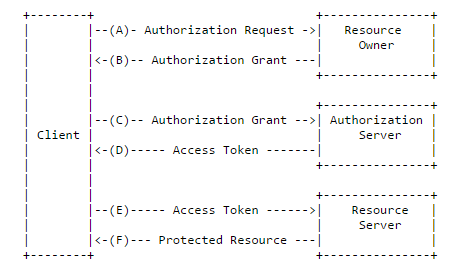
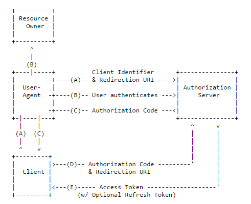
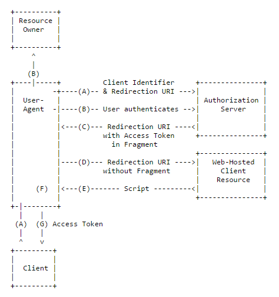
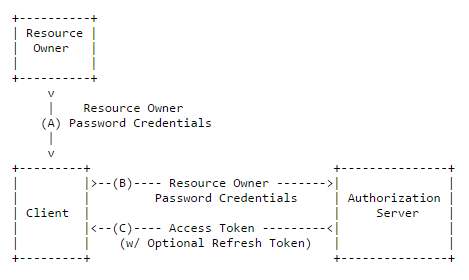

# OAuth 2.0


The OAuth 2.0 authorization framework enables a third-party application to obtain limited access to an HTTP service, either on behalf of a resource owner by orchestrating an approval interaction between the resource owner and the HTTP service, or by allowing the third-party application to obtain access on its own behalf.

The main features of the Tizen.Account.OAuth2 namespace include:

-   Creating an OAuth 2.0 request

    You can [create a request handle, set and retrieve request parameters, and pass the request to the OAuth 2.0 manager](#request) to request a token.

-   Sending the request to the server to ask for a [grant or token](#grant)

    You can [request the authorization server for the required OAuth 2.0 grant or token](#token) using various methods and grant types.

-   Managing the server response

    You can [obtain information from the OAuth 2.0 response handle](#response) returned in a callback.

**Figure: Protocol flow**



The OAuth 2.0 specification is defined in [\[RFC 6749\]](http://tools.ietf.org/html/rfc6749) and it builds on the OAuth 1.0 [\[RFC 5849\]](http://tools.ietf.org/html/rfc5849) deployment experience, as well as additional use cases and extensibility requirements gathered from the wider IETF community. The OAuth 2.0 protocol is not backward-compatible with OAuth 1.0.

<a name="grant"></a>
## Authorization Grant

An authorization grant is a credential representing the resource owner's authorization (to access its protected resources) used by the client to obtain an access token.

The specification defines the following 4 grant types as well as an extensibility mechanism for defining additional types:

-   Authorization code

    The [authorization code is obtained](#req_code) by using an authorization server as an intermediary between the client and resource owner. Instead of requesting authorization directly from the resource owner, the client directs the resource owner to an authorization server, which in turn directs the resource owner back to the client with the authorization code.

    The authorization code provides some important security benefits, such as the ability to authenticate the client, as well as the transmission of the access token directly to the client without passing it through the resource owner's user-agent and potentially exposing it to others, including the resource owner.

    **Figure: Authorization code flow**

    

-   Implicit

    In the implicit flow, the client is issued an access token directly (as a result of the resource owner authorization). The grant type is implicit, as no intermediate credentials (such as an authorization code) are issued.

    Implicit grants improve the responsiveness and efficiency of some clients (such as a client implemented as an in-browser application), since it reduces the number of round trips required to obtain an access token.

    **Figure: Implicit grant flow**

    

-   Resource owner password credentials

    The resource owner password credentials (such as username and password) can be used directly as an authorization grant to obtain an access token.

    Even though this grant type requires direct client access to the resource owner credentials, the resource owner credentials are used for a single request and are exchanged for an access token. This grant type can eliminate the need for the client to store the resource owner credentials for future use, by exchanging the credentials with a long-lived access token or refresh token.

    **Figure: Resource owner password credentials flow**

    

-   Client credentials

    The client credentials can be used as an authorization grant when the authorization scope is limited to the protected resources under the control of the client, or to protected resources previously arranged with the authorization server. Client credentials are typically used as an authorization grant when the client is acting on its own behalf (the client is also the resource owner) or is requesting access to protected resources based on an authorization previously arranged with the authorization server.

    **Figure: Client credentials flow**

    

To request an access token for the implicit, resource owner password credentials, or client credentials grant type, follow the [direct access token request instructions](#direct_token).

## Prerequisites

To enable your application to use the OAuth 2.0 functionality:

1.  To use the [Tizen.Account.OAuth2](https://developer.tizen.org/dev-guide/csapi/api/Tizen.Account.OAuth2.html) namespace, the application has to request permission by adding the following privilege to the `tizen-manifest.xml` file:

    ```
    <privileges>
       <privilege>http://tizen.org/privilege/internet</privilege>
    </privileges>
    ```

2.  To use the methods and properties of the Tizen.Account.OAuth2 namespace, include it in your application:

    ```
    using Tizen.Account.OAuth2;
    ```

> **Note**   
> The use cases in this guide refer to an `OAuth2Helper` class, which is a user-created class whose purpose is to handle various OAuth2 requests.

<a name="request"></a>
## Creating and Managing an OAuth 2.0 Request

To make a request with the OAuth 2.0 manager:

1.  Create an OAuth2 request:

    ```
    var request = OAuth2Helper.CreateCodeGrantAuthRequest(true);
    ```

2.  Set the parameters needed for making the request.

    You can set various request properties, such as end points for authentication and token, grant type, client credentials, scopes, authentication scheme, user name, and password.

    ```
    internal const string GOOGLE_AUTH_URL = "https://accounts.google.com/o/oauth2/auth";
    internal const string GOOGLE_TOK_URL = "https://accounts.google.com/o/oauth2/token";
    internal const string GOOGLE_REDIRECT_URL = "https://localhost:8080";
    internal const string GOOGLE_CLIENT_ID = "12345678901.apps.googleusercontent.com";
    internal const string GOOGLE_CLIENT_SECRET = "1ABCD-E2FG3hijkL4MNOp5Qr";
    internal const string GOOGLE_SCOPE = "email";
    internal const string USER_NAME = "username";
    internal const string PASSWORD = "password";

    internal static CodeGrantAuthorizationRequest CreateCodeGrantAuthRequest()
    {
        return new CodeGrantAuthorizationRequest()
        {
            AuthorizationEndpoint = new Uri(GOOGLE_AUTH_URL),
            RedirectionEndPoint = new Uri(GOOGLE_REDIRECT_URL),
            TokenEndpoint = new Uri(GOOGLE_TOK_URL),
            ClientSecrets = new ClientCredentials()
            {
                Id = GOOGLE_CLIENT_ID,
                Secret = GOOGLE_CLIENT_SECRET
            },
            Scopes = new string[] {GOOGLE_SCOPE},
            State = "DCEEFWF45453sdffef424"
        };
    }

    internal static CodeGrantTokenRequest CreateCodeGrantTokenRequest()
    {
        return new CodeGrantTokenRequest()
        {
            RedirectionEndPoint = new Uri(GOOGLE_REDIRECT_URL),
            TokenEndpoint = new Uri(GOOGLE_TOK_URL),
            ClientSecrets = new ClientCredentials()
            {
                Id = GOOGLE_CLIENT_ID,
                Secret = GOOGLE_CLIENT_SECRET
            },
            Scopes = new string[] {GOOGLE_SCOPE},
            Code = GOOGLE_AUTH_GRANT_CODE,
            AuthenticationScheme = AuthenticationScheme.RequestBody,
        };
    }
    ```

3.  When you no longer need it, free the request by setting it to `null`:

    ```
    public static void Destroy()
    {
        request = null;
    }
    ```

<a name="token"></a>
## Requesting the Server for a Grant or Token

To obtain the required authorization code or access token:

-   <a name="req_code"></a>Request the authorization code.

    The authorization code grant type is used to obtain both access tokens and refresh tokens. It is a redirection-based flow that requires the client to interact with the server and receive the incoming requests (through redirection) from the authorization server.

    To request the authorization code, use the `AuthorizeAsync()` method of the [Tizen.Account.OAuth2.CodeGrantAuthorizer](https://developer.tizen.org/dev-guide/csapi/api/Tizen.Account.OAuth2.CodeGrantAuthorizer.html) class:

    ```
    public static async Task AuthorizeAsync_CHECK_EXCEPTION()
    {
        /// Precondition
        /// 1. Valid CodeGrantAuthorizer object
        /// 2. Prepared CodeGrantAuthorizationRequest parameters

        var authorizer = new CodeGrantAuthorizer();
        Assert.IsNotNull(authorizer, "Object should not be null after construction");

        var request = OAuth2Helper.CreateCodeGrantAuthRequest();
        Assert.IsNotNull(request, "Object should not be null after construction");

        /// Test case
        try
        {
            var response = await authorizer.AuthorizeAsync(request);
            Assert.IsTrue(false, "Expected to throw an exception");
        }

        catch (Exception ex)
        {
            Assert.IsTrue(ex is OAuth2Exception, "Wrong exception thrown. Expected is OAuth2Exception");
        }

        /// Postcondition
        authorizer.Dispose();
    }
    ```

-   Request the access token.

    Access tokens are credentials used to access protected resources. An access token is a string representing an authorization issued to the client. Tokens represent specific access scopes and durations, granted by the resource owner, and enforced by the resource server and authorization server.

    -   Request the access token with the authorization code.

        In the authorization code grant type, instead of requesting authorization directly from the resource owner, the client directs the resource owner to an authorization server, which in turn directs the resource owner back to the client with the authorization code.

        1.  [Request the authorization code](#req_code) with the `AuthorizeAsync()` method. The authorization code is returned in a callback.
        2.  Use the authorization code to request the access token by calling the `GetAccessTokenAsync()` method:

            ```
            public static async Task GetAccessTokenAsync_CHECK_EXCEPTION()
            {
                /// Precondition
                /// 1. Valid CodeGrantAuthorizer object
                /// 2. Prepared CodeGrantTokenRequest parameters

                var authorizer = new CodeGrantAuthorizer();
                Assert.IsNotNull(authorizer, "Object should not be null after construction");

                var request = OAuth2Helper.CreateCodeGrantTokenRequest();
                Assert.IsNotNull(request, "Object should not be null after construction");

                /// Test case
                try
                {
                    var response = await authorizer.GetAccessTokenAsync(request);
                    Assert.IsTrue(false, "Expected to throw an exception");
                }

                catch (Exception ex)
                {
                    Assert.IsTrue(ex is OAuth2Exception, "Wrong exception thrown. Expected is OAuth2Exception");
                }

                /// Postcondition
                authorizer.Dispose();
            }
            ```

    -   <a name="direct_token"></a>Request the access token directly.

        You can request an access token in a single step without obtaining the authorization code explicitly. For the authorization code grant type, the code is obtained after the authentication and passed to the server to obtain the access token internally. For the implicit, resource owner password credentials, and client credentials grant types, you can obtain the access token directly.

        To obtain the access token directly, use the `GetAccessTokenAsync()` method. The response from the server is included in a callback.

        ```
        internal static ResourceOwnerPwdCredentialsTokenRequest CreateRoPwdTokenRequest()
        {
            return new ResourceOwnerPwdCredentialsTokenRequest()
            {
                TokenEndpoint = new Uri(GOOGLE_TOK_URL),
                ClientSecrets = new ClientCredentials()
                {
                    Id = GOOGLE_CLIENT_ID,
                    Secret = GOOGLE_CLIENT_SECRET
                },
                AuthenticationScheme = AuthenticationScheme.RequestBody,
                Username = "user name",
                Password = "password",
                RedirectionEndPoint = new Uri(GOOGLE_REDIRECT_URL),
                State = "state"
            };
        }

        public static async Task GetAccessTokenAsync_CHECK_EXCEPTION()
        {
            /// Precondition
            /// 1. Valid ResourceOwnerPwdCredentialsAuthorizer object
            /// 2. Prepared ResourceOwnerPwdCredentialsTokenRequest parameters

            var authorizer = new ResourceOwnerPwdCredentialsAuthorizer();
            Assert.IsNotNull(authorizer, "Object should not be null after construction");

            var request = OAuth2Helper.CreateRoPwdTokenRequest();
            Assert.IsNotNull(request, "Object should not be null after construction");

            /// Test case
            try
            {
                var response = await authorizer.GetAccessTokenAsync(request);
                Assert.IsTrue(false, "Expected to throw an exception");
            }

            catch (Exception ex)
            {
                Assert.IsTrue(ex is OAuth2Exception, "Wrong exception thrown. Expected is OAuth2Exception");
            }

            /// Postcondition
            authorizer.Dispose();
        }

        internal static ClientCredentialsTokenRequest CreateClientCredsTokenRequest(bool dummy = false)
        {
            return new ClientCredentialsTokenRequest()
            {
                TokenEndpoint = new Uri(GOOGLE_TOK_URL),
                RedirectionEndPoint = new Uri(GOOGLE_REDIRECT_URL),
                AuthenticationScheme = AuthenticationScheme.Basic,
                ClientSecrets = new ClientCredentials()
                {
                    Id =  GOOGLE_CLIENT_ID,
                    Secret = GOOGLE_CLIENT_SECRET
                }
            };
        }

        public static async Task GetAccessTokenAsync_CHECK_EXCEPTION()
        {
            /// Precondition
            /// 1. Valid ClientCredentialsAuthorizer object
            /// 2. Prepared ClientCredentialsTokenRequest parameters

            var authorizer = new ClientCredentialsAuthorizer();
            Assert.IsNotNull(authorizer, "Object should not be null after construction");

            var request = OAuth2Helper.CreateClientCredsTokenRequest();

            Assert.IsNotNull(request, "Object should not be null after construction");

            /// Test case
            try
            {
                var response = await authorizer.GetAccessTokenAsync(request);
                Assert.IsTrue(false, "Expected to throw an exception");
            }

            catch (Exception ex)
            {
                Assert.IsTrue(ex is OAuth2Exception, "Wrong exception thrown. Expected is OAuth2Exception");
            }

            /// Postcondition
            authorizer.Dispose();
        }
        ```

-   Refresh the access token.

    Refresh tokens are credentials used to obtain access tokens. Refresh tokens are issued to the client by the authorization server and are used to obtain a new access token when the current access token becomes invalid or expires, or to obtain additional access tokens with an identical or narrower scope.

    To refresh an access token, use the `RefreshAccessTokenAsync()` method of the [Tizen.Account.OAuth2.ClientCredentialsAuthorizer](https://developer.tizen.org/dev-guide/csapi/api/Tizen.Account.OAuth2.ClientCredentialsAuthorizer.html) class. The response from the server is included in a callback.

    ```
    internal static RefreshTokenRequest CreateRefreshTokenRequest()
    {
        return new RefreshTokenRequest()
        {
            TokenEndpoint = new Uri(GOOGLE_REFRESH_TOKEN_URL),
            ClientSecrets = new ClientCredentials()
            {
                Id = GOOGLE_CLIENT_ID,
                Secret = GOOGLE_CLIENT_SECRET
            },
            AuthenticationScheme = AuthenticationScheme.Basic,
            RedirectionEndPoint = new Uri(GOOGLE_REDIRECT_URL),
            RefreshToken = "AQkAQHKoQRyhc7nlxuk4ecr8MC_7kUoBQxCXQ8PpH3u2VNq2KP96UMrCrrav.aO6gHMVhTeeJt_6PVAUqmP5bQSxH8GWp2sO"
        };
    }

    public static async Task RefreshAccessTokenAsync_CHECK_EXCEPTION()
    {
        /// Precondition
        /// 1. Valid ResourceOwnerPwdCredentialsAuthorizer object
        /// 2. Prepared ResourceOwnerPwdCredentialsTokenRequest parameters

        var authorizer = new ResourceOwnerPwdCredentialsAuthorizer();
        Assert.IsNotNull(authorizer, "Object should not be null after construction");

        var request = OAuth2Helper.CreateRefreshTokenRequest();
        Assert.IsNotNull(request, "Object should not be null after construction");

        /// Test case
        try
        {
            var response = await authorizer.RefreshAccessTokenAsync(request);
            Assert.IsTrue(false, "Expected to throw an exception");
        }
        catch (Exception ex)
        {
            LogUtils.Write(LogUtils.DEBUG, LogUtils.TAG, ex.ToString());
            Assert.IsTrue(true, "Exception should be thrown");
        }

        /// Postcondition
        authorizer.Dispose();
    }
    ```

<a name="response"></a>
## Managing an OAuth 2.0 Response

The response from the server is returned as an instance of the [Tizen.Account.OAuth2.AuthorizationResponse](https://developer.tizen.org/dev-guide/csapi/api/Tizen.Account.OAuth2.AuthorizationResponse.html) class, from which all the various response parameters can be obtained.

To manage the OAuth 2.0 response:

1.  Retrieve the response parameters from the response.

    You can get various response information, such as the authorization code, state, and custom value.

    ```
    public static async Task RetrieveResponseInfo()
    {
        /// Precondition
        /// 1. Valid CodeGrantAuthorizer object
        /// 2. Prepared CodeGrantAuthorizationRequest parameters
        /// 3. Request for authorization grant

        string code;
        string state;

        var authorizer = new CodeGrantAuthorizer();

        var request = OAuth2Helper.CreateCodeGrantAuthRequest();

        /// Test case
        try
        {
            var response = await authorizer.AuthorizeAsync(request);

            Console.WriteLine("Code: {0}", response.Code);
            Console.WriteLine("State: {0}", response.State);
            Console.WriteLine("custom data: {0}", response.GetCustomValue("key1"));
        }

        catch (Exception ex)
        {
            LogUtils.Write(LogUtils.DEBUG, LogUtils.TAG, ex.ToString());
        }

        /// Postcondition
        authorizer.Dispose();
    }
    ```

2.  Handle response errors.

    If the created request is incorrect or missing required permissions, the server response contains an error. Retrieve the error information from the response to check the issue, using the `Error` property of the created [Tizen.Account.OAuth2.OAuth2Exception](https://developer.tizen.org/dev-guide/csapi/api/Tizen.Account.OAuth2.OAuth2Exception.html) instance:

    ```
    public static async Task RetrieveServerErrorCode()
    {
        /// Precondition
        /// 1. Valid ResourceOwnerPwdCredentialsAuthorizer object
        /// 2. Prepared ResourceOwnerPwdCredentialsTokenRequest parameters

        var authorizer = new ResourceOwnerPwdCredentialsAuthorizer();

        var request = OAuth2Helper.CreateRoPwdTokenRequest();
        request.Username = "dummy";

        /// Test case
        try
        {
            var response = await authorizer.GetAccessTokenAsync(request);
        }

        catch (Exception ex)
        {
            var exception = ex as OAuth2Exception;
            var errorResponse = exception.Error;
        }
    ```

3.  When you no longer need it, free the response handle with the `Dispose()` method:

    ```
        /// Postcondition
        authorizer.Dispose();
    }
    ```


## Related Information
* Dependencies
  -   Tizen 4.0 and Higher
