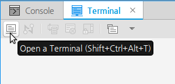
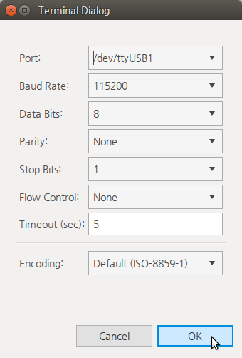
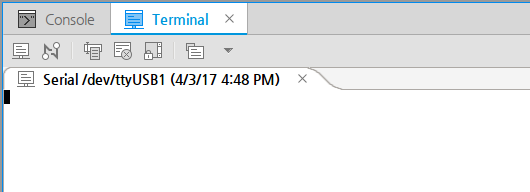
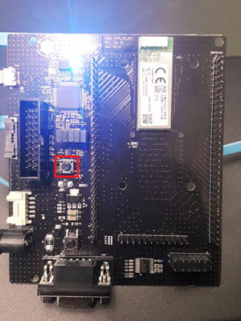
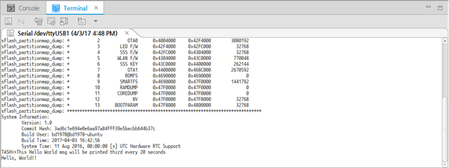
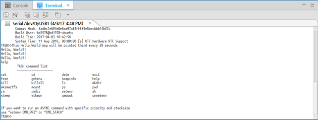

# Using the Serial Terminal

If you have flashed the project successfully, you can communicate with the board using the **Terminal** view.

> **Note**  
> The board must be continuously connected to your computer.

The **Terminal** view provides various functions:

- Opening a terminal
- Disconnecting the terminal connection
- Toggling the command input field
- Clearing the terminal
- Enabling the scroll lock
- Copying and pasting
- Opening a new **Terminal** view

## Opening a Terminal

To open a terminal:

1. Click the **Open a Terminal** toolbar button.

 

2. In the Terminal Dialog, set the information to connect the board, and click **OK**.

 

You can see the opened terminal with a serial connection in the **Terminal** view.

**Figure: Opened terminal**

## Communicating with the Tash Commands

To use the tash commands, push the **Soft Reset** button on the board.

**Figure: Soft Reset button**

You can see the booting logs on the **Terminal** view with the TASH prompt.

**Figure: Booting logs**

To see the available tash commands, run the `help` command on the TASH prompt. You can also easily test the communication with the board using the various commands provided by the **Terminal** view.

**Figure: Tash command list**

## Related information
* Dependencies
  - Ubuntu Only
